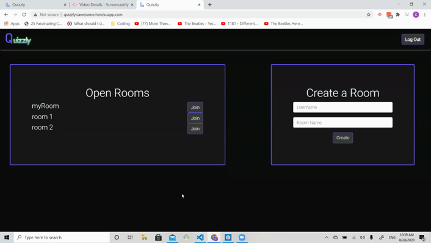
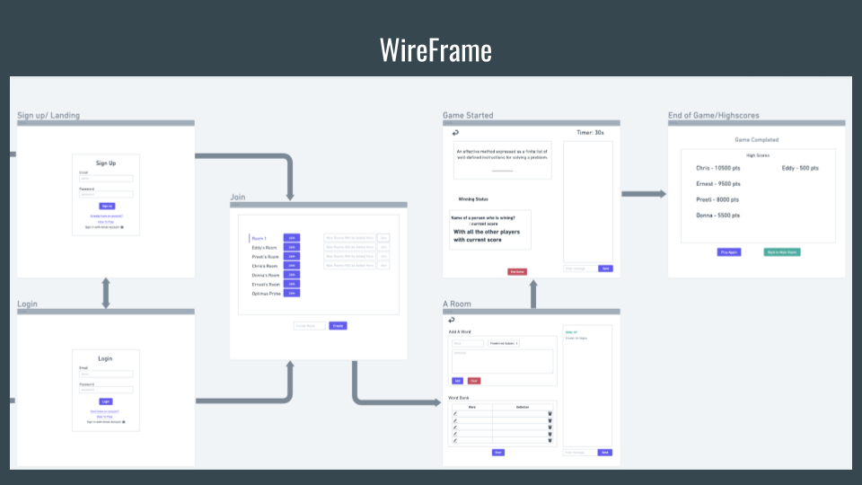
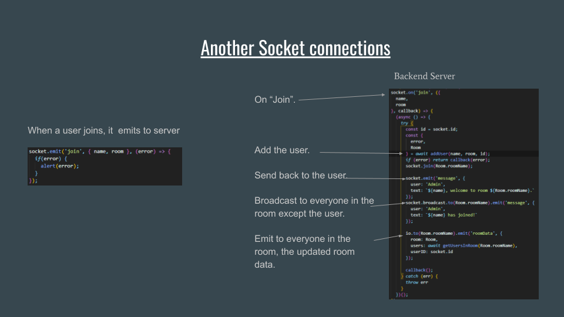
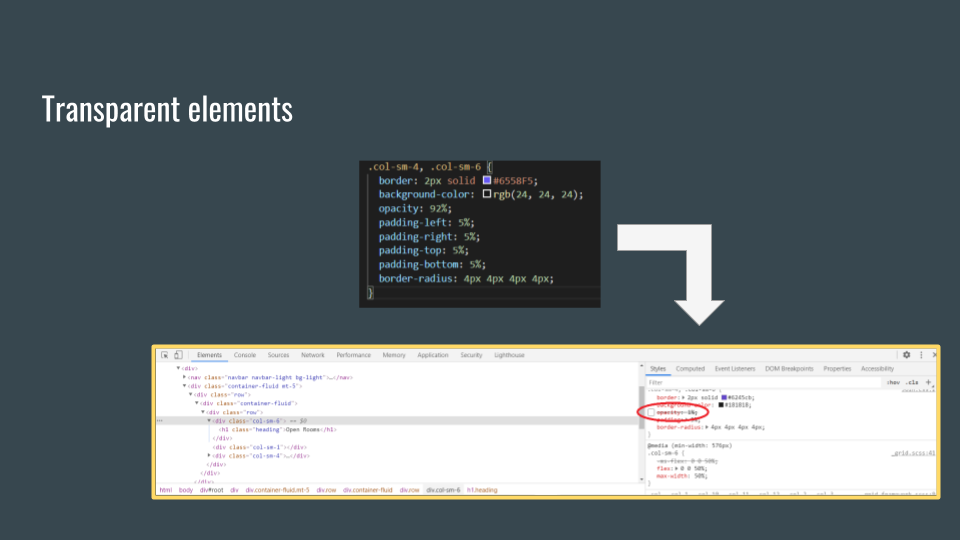

 

## Quizzly
Quizzly is a real-time game that allows users to create and join different chatrooms as they try and guess the word to definitions displayed on screen.

## Table of Contents
* [Description](#description)
* [Technology](#technology)
* [Screenshots](#screenshots)
* [Approach](#approach)
* [Installation](#installation)
* [Deployment](#deployment)
* [Issues](#issues)
* [Authors](#authors)

## Description
This game allows users to chat in real-time to guess the definition of words. It can be for students who want to study together, teachers who want to have a user-friendly interface to teach their students definitions, and also friends who simply want to play a guessing game!

##  Technology

* ReactJS 

* Node and Express Web Server

* MongoDB 

* Mongoose ORM 

* Heroku

* Firebase

* Socket.IO 

 

## Screenshots

## Approach

### UI Design

### Leveraging socket.io to send information bi-directionally

### Managing Users

### Managing Rooms

## Installation
 * Download the Repo URL

 * In Terminal/Bash: 'git clone' the URL 

 * npm install

 * npm start

 * View On 'localhost:3000'

## Deployment
[Quizzly](http://quizzlyisawesome.herokuapp.com/) is deployed using Heroku and MongoDb Atlas for database

## Issues

Upon initial deployment, the team discovered that certain elements were transparent, despite having opacity set at 92%.

The above illustrates a known bug where opacity is set to 1% upon deployment. To workaround this issue, opacity can be set as a decimal instead of a percentage.

## Authors

**Christopher Lee** 
- [Link to Github](https://github.com/CofChips)
- [Link to LinkedIn](https://www.linkedin.com/in/christophernlee/)

**Eddy Yang**
- [Link to Github](https://github.com/eddyangang)
- [Link to LinkedIn](https://www.linkedin.com/in/eddy-yang-213b43189/)

**Ernest Urzua**
- [Link to Github](https://github.com/ErnestUrzua)
- [Link to LinkedIn](https://www.linkedin.com/in/ernesturzua/)

**Donna Nguyen**

- [Link to Github](https://github.com/donnaxnguyen)
- [Link to LinkedIn](https://www.linkedin.com/in/donna-nguyen01/)

**Preeti Gupta**
- [Link to Github](https://github.com/preeti1234567)
- [Link to LinkedIn](https://www.linkedin.com/in/preetigupta-59a5641ab/)

<!-- ## Software Requirements
- must use React
- must use a `Header` component that appears on multiple pages
- must use a single `Project` component that will be used multiple times on a single page
- must use navigation with React Router
- must have a `Footer` component that will be used on multiple times on a single page -->